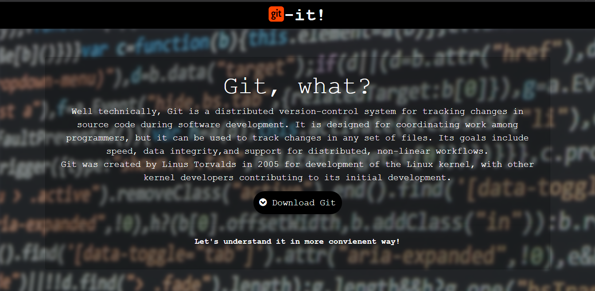
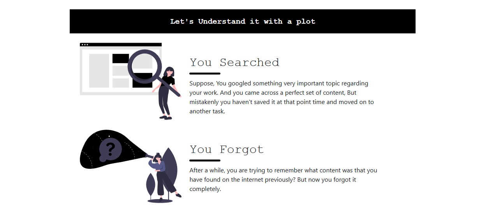
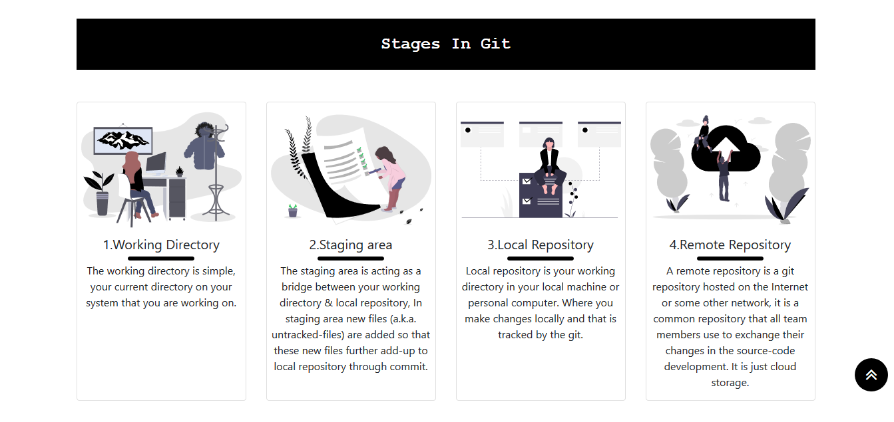
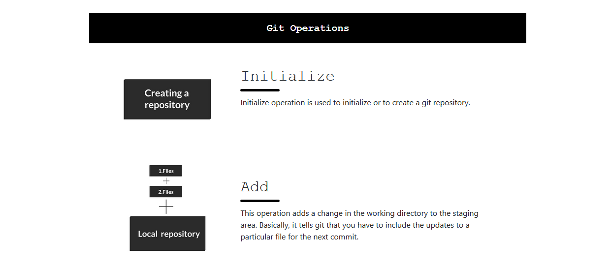
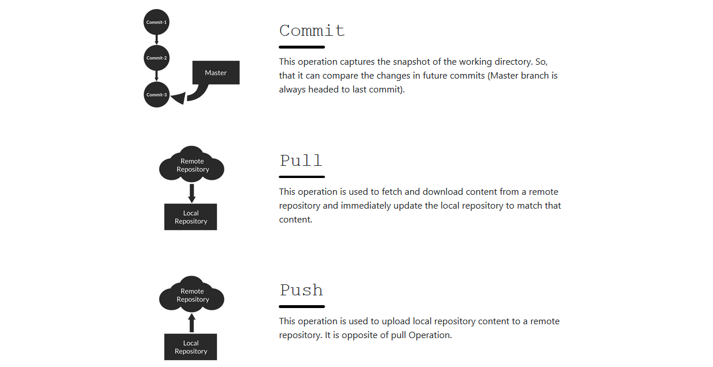
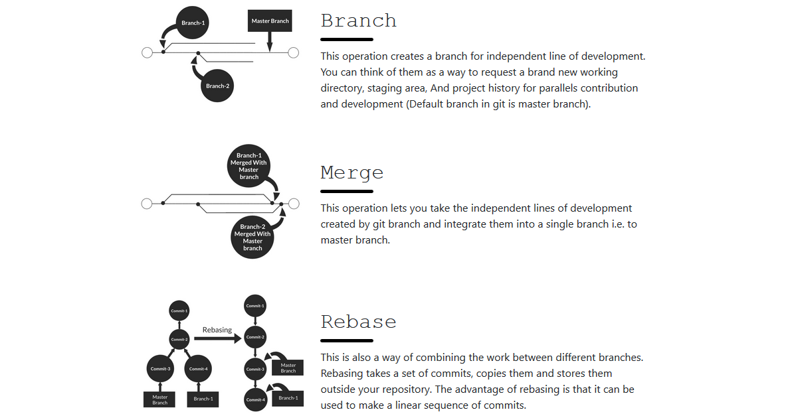
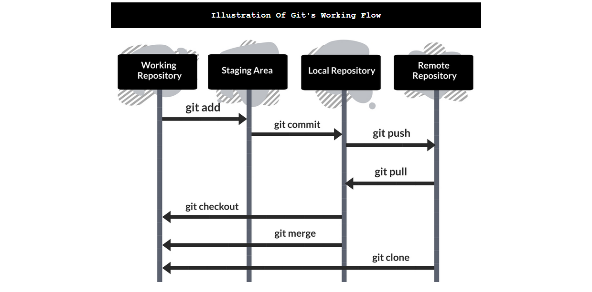
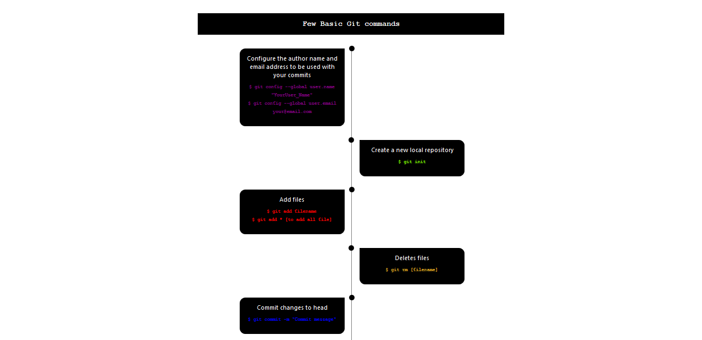
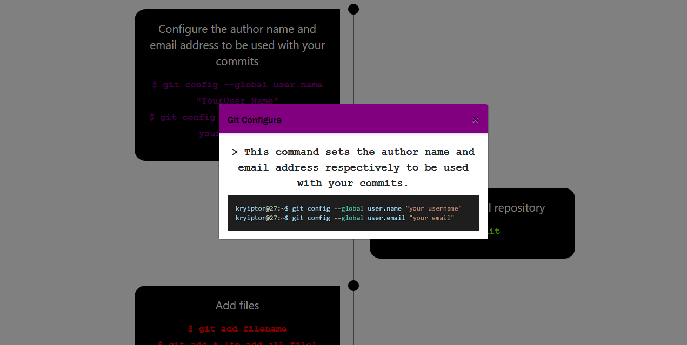

# This is the repo of git-it! website.
<h3>I've created this website in-order to share the concept & working of git version control system in form of a static website from best of my little knowledge.
  <strong>This is the link for the website: https://kriyptor.github.io/git-it/</strong></h3>
<h3><strong>Following are the some snippets to provide you an overview of the website.</strong><h3>
  <ol>
  <li>Prior information about git
      

     
  </li>
  <li>Short Plot to understand the git
    

     
  </li>
  <li>Section about the stages in git 
    

     
  </li>
  <li>What are the operations that comences in git
    

     
     
     
  </li>
  <li>Visual representation of git's working
    

    
  </li>
  <li>Some basic git commands list
    

    
  </li>
  <li>Detailed information of a git command
    

    
  </li>
  <li>Button to download the free git cheat sheet!
    

    
  </li>
  </ol>
  Thank you for giving your time, <a href="https://www.linkedin.com/in/shivanshu-kashyap-258431192/">If possible I would love to know your feedback!</a>
